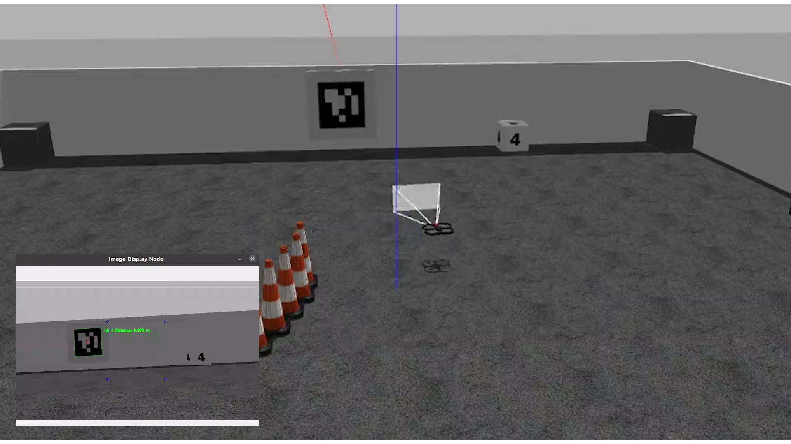
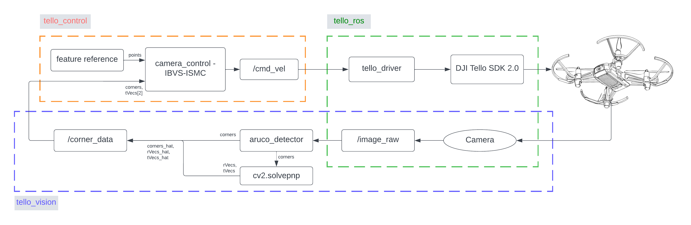
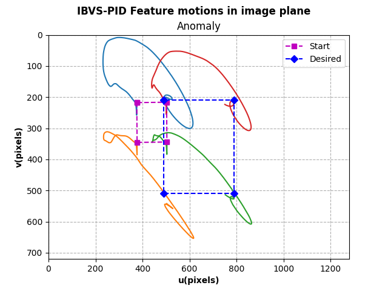
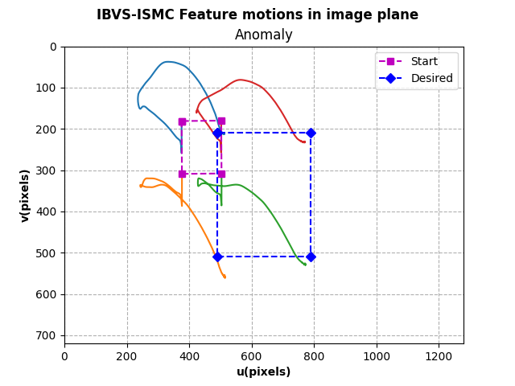

# Autonomous Quadcopter Position Control using Visual Servoing Simulation in Gazebo
My second phase for my undergraduate thesis which is simulation the vision part, which is the crucial part on my undergraduate thesis. A Quadcopter navigation system using the visual sensor as it's main navigation sensor system to reach it's destination. This package program is a quadrotor simulation program forked from sjtu_drone(https://github.com/NovoG93/sjtu_drone), developed using ROS 2 Foxy - Gazebo Classic 11 Simulation.
<p align="center">
  
</p>

## Downloading
In this simulation, I have divide it into two section, which is capturing the visual and control, where each of them form two node that is the image_subscriber and camera_control. So the thing you wanna do is first make your own workspace and put all the code in this github to the src folder. 

```sh
$ mkdir yourworkspace/src
$ cd yourworkspace/src/
$ git clone https://github.com/WallNutss/EE234899-Quadcopter-Gazebo-VisualServoing.git
```
To use the .world file in the simulation, make sure to install the common gazebo models, for more see the Readme in sjtu_drone_description.

## How to Run (ROS 2 Foxy)
1. After you download the code and install Gazebo 11 for Foxy, you can start gazebo and spawn drone:
`$ ros2 launch  sjtu_drone_bringup sjtu_drone_bringup.launch.py`
2. Start the camera capture node and takeoff the drone
`$ ros2 run image_subscriber pose_display`
3. Start IBVS for the drone to go
If you want to choose IBVS-PID
`$ ros2 run camera_control ibvs-pid`
If you want to choose IBVS-ISMC
`$ ros2 run camera_control ibvs-smc`
4. Land drone:
`$ ros2 topic pub /drone/land std_msgs/msg/Empty {} --once`
5. Record data (pick anything you like from topics)
`$ ros2 bag record /corner_data /error_data /drone/gt_pose /drone/gt_vel /drone/gt_acc /drone/cmd_vel -o dataname`

## What you can do
In default, if you run it the way instruction up there, the default placement will be you will be running on world with `scenario2.world` and there will be no noise in the system. So if you want to play around you can do

1. If you want to play around with the urdf of the models or the quadcopter model, you can head out to `urdf\sjtu_drone.urdf.xacro`. Nothing has changed from the original forke except I tweek some of the camera intrinsic matrics and the transformation axes of the camera to match with direction of opencv. For getting camera matrixs, you can see [here](https://navigation.ros.org/tutorials/docs/camera_calibration.html) to use ROS available camera calibration tools and for matching the tf direction to openCV, [here](https://answers.ros.org/question/232534/gazebo-camera-frame-is-inconsistent-with-rviz-opencv-convention/) the reference. As I mention before, in default I didn't activate the noise in the simulation. In original forke,the already have their own noise(albeit it's a little bit weird, where the noise is inputted to `\cmd_vel` topics). but if you want to activate it, go to the urdf and set motionSmallNoise,motionDriftNoise, motionDriftNoiseTime to respectively 0.02, 0.05, and 2.0. anyway [here](https://github.com/NovoG93/sjtu_drone/blob/ros2/sjtu_drone_description/src/plugin_drone_private.cpp#L212) the explanation of the noise.
2. There's little to be changed in the vision part, especially in `image_pose_display_node`. I'm using ArUco Marker with DICT 5x5_100, so you can play around what number ID you want to be tracking. I'm using ID#2. So if you are using beside that number, you can change them in line 108. This node already been updated to have optical flow estimation inside. So if there is loss of sight of the marker, it can estimate it possible location in the image frame.
3. In `camera_control`, You got two option either IBVS-PID or IBVS-ISMC. In this node, you can experiment a lot of the parameter to control Quadcopter based on IBVS. You can change the Kp,Ki,Kd on the IBVS-PID or sliding surface in the IBVS-ISMC. You can also change the gain of the IBVS Control, `lambda_s` on the constructor class. But be aware that increasing it beyond 0.2 will make lose sight of the marker. In default, I have tune it to just work, not optimally. So have fun.

## System Architecture
<p align="center">
  
</p>

### Camera Capture
In this simulation, the function is represented by  node `image_subscriber`. At first, you will need to define the camera_intrinsic of the camera. In my case, I use DJI Tello as my model camera, you can calibrate your camera through any means where I use Charuco Board Calibration Methods. The image data is pass through message, the node will capture the messsage topics and convert them to opencv picture format. If the corresponded marker ID is equal to the one I'm searching, then it will pass that marker location in the image frame to another topics, `corner_data`, where it will be processed later in the control.
### Image Based Visual Servoing
All the control is done in the `camera_control` node. So the control is based on IBVS(Image Based Visual Servoing), where it tried to control quadcopter to reach it's destination based on the information it capture from the visual sensor (camera). In the simulation, four feature points are taken as to represent marker in a way in image frame are. And based on those location of the feature, We want to deliver those points to desired feature location still on the image frame. The calculation is all done in one program and the end result is `\cmd_vel` to the quadcopter based on the algorithm.

## Results
Image Feature Points Trajectory side-to-side based on Controller
<p align="center">
  
  
</p>
Image Error Feature Points Trajectory side-to-side based on Controller
<p align="center">
  
  
</p>
Command Velocity of the Quadcopter side-to-side based on Controller
<p align="center">
  
  
</p>
Trajectory of the Quadcopter side-to-side based on Controller
<p align="center">
  
</p>

All above are based on desired feature forming a shape of squares with side length of 300px as you can see in the feature motions. But what if the desired feature doesn't have symmetric length? It's asymmetric length with height of 330px and width of 250px forming a block
Image Feature Points Anomaly Trajectory side-to-side based on Controller
<p align="center">
  
  
</p>
Anomaly Trajectory of the Quadcopter side-to-side based on Controller
<p align="center">
  
</p>

As you can see, with IBVS we can freely choose the ideal position based on the image information and based on those calculation, it will reflect them differently based on those desired feature location.

## Advice
* There is no bonafide representation of disturbance like wind etc on the simulation. It is because I'm unable to add them because how confusing it is Gazebo-ROS architecture can be
* Adding another controller but tied it with IBVS
* Reprogram all of this into c++ ecosystem. I heard it will become faster

## Author
Muhammad Juniarto

Email : wallnuts73@gmail.com

## Reference
<a id="1">[1]</a> 
Corke, P (2011). 
Vision-Based Control
Robotics, Vision and Control pp 455–479

<a id="1">[2]</a> 
Li, S., Ghasemi, A., Xie, W., & Gao, Y. (2017). 
Sliding Mode Control (SMC) of Image‐Based Visual Servoing for a 6DOF Manipulator
In Recent Developments in Sliding Mode Control Theory and Applications. InTech
